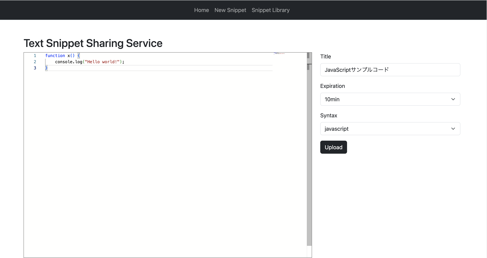
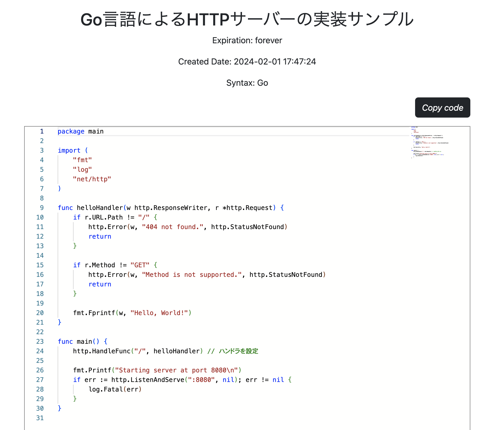
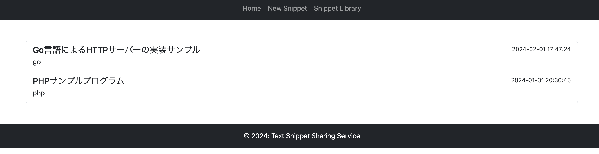

# Text-Snippet-Sharing-Service

## 概要

このサービスはちょっとしたコードや一時的に保存しておきたいテキストを管理するアプリケーションです。</br>
↓ こんな時に役立つ！

- よく使うコードを保存してコピペ運用ができる！
- チームメンバーに簡単にコードの共有ができる！
- 他の人のコードを参考にできる！

以下プロジェクト URL</br>
https://text-snippet-sharing-service.seiprojects.com/snippet/create

## DEMO

<video width="640" height="340" controls>
  <source src="./public/demo.mp4" type="video/mp4">
  Your browser does not support the video tag.
</video>

## 開発環境の構築

今回は開発環境のみ Docker を使って開発をしてるので誰でもすぐにローカルマシンで動作確認が可能です</br>

### リポジトリをクローン

```bash
git clone https://github.com/seiichikick0404/Text-Snippet-Sharing-Service.git
```

### 環境変数の配置

以下を.env ファイルに記述し、プロジェクト直下と src ディレクトリ直下に配置してください。

```bash
DATABASE_NAME=text_snippet_sharing_service
DATABASE_USER=任意のユーザー名
DATABASE_PASSWORD=任意のパスワード
DATABASE_ROOT_PASSWORD=任意のパスワード
DATABASE_HOST=mysql
```

### Docker イメージをビルド・コンテナ起動

クローンしたプロジェクトのルートディレクトリで以下を実行</br>
Docker をインストールしてない場合は公式からインストールしてから以下コマンドを実行してください。

```bash
# ビルド処理
docker compose build

# コンテナ立ち上げ
docker compose up -d
```

### マイグレーション実行

必要なテーブルを即座に構築します。

```bash
php console migrate --init
```

### シーダー実行

必要なレコードを即座に登録します。

```bash
php console seed
```

ここまで正常に動作したら以下の URL から動作を確認してください。</br>
http://localhost:8080/

## 使い方

### スニペットの登録



ヘッダーから Home もしくは New Snippet を選択し、各入力欄を埋めて下さい。</br>
| 入力項目 | 内容 |
| ---- | ---- |
| テキストエディタ | 保存したいスニペットを入力 |
| Title | スニペットのタイトルを入力</br>「Python 三項演算子の書き方」など |
| Expiration | 有効期限をプルダウンから選択 |
| Syntax | 構文のスタイルプルダウンから選択</br>選択中の構文ハイライトが反映されます |
| Upload | 登録ボタン |

登録後は一意の URL が生成され、自動で以下の画面に遷移します。</br>



### スニペット一覧


</br>
アップロードしたスニペットはSnippet Libraryから確認することができます。</br>
有効期限の切れたスニペットは表示されません。

## 主な使用技術

<p style="display: inline">
  <!-- PHP -->
  
  <!-- MySQL -->
  
  <!-- HTML5 -->
  
  <!-- CSS3 -->
  
    <!-- JavaScript -->
  
  <!-- Amazon AWS -->
  
</p>
  <!-- Amazon EC2 -->
  
  <!-- Nginx -->
  
  <!-- Ubuntu -->
  
  <!-- Docker -->
  
  <!-- Bootstrap -->
  
</p>

### その他ツールライブラリ

| 名称          | 用途                   |
| ------------- | ---------------------- |
| Monaco Editor | テキストエディタの生成 |
| Draw.io       | ER 図やクラス図の作成  |
| Certbot       | SSL 証明書発行など     |
| GitHub        | ソースコードの管理     |

## 開発の経緯

- 3 層アーキテクチャの開発経験
- Amazon EC2 を使ったデプロイ
- MVC アーキテクチャの習熟
- シーダーやマイグレーションシステムの理解

## 工夫した点や苦労した点

### 一意の URL 生成

スニペットを保存すると一意の URL が生成されます。</br>
一意な文字列をハッシュ化して生成しています。</br>
これにより各スニペット固有のページを実現することができました。

### マイグレーションシステム

```bash
php console migrate --init
```

--init オプションを付けることでデータベースに migrations テーブルを生成してからマイグレーションを実行します。</br>
migrations テーブルで現在のマイグレーションファイルの実行状態を管理してます。</br>
マイグレーションファイルにはテーブルスキーマを up と down 関数に記述します。</br>
up にはマイグレート時の処理を、down にはロールバックをした際に行うクエリを記述します。</br>
※詳しくはコマンド一覧を参照

### シーダーシステム

```bash
php console seed
```

上記を実行することでダミーデータを投入することができます。</br>
テストデータを大量に入れたい場合に便利です。
※詳しくはコマンド一覧を参照

### 本番環境へのデプロイ

- 適切なパーミッション設定
- ファイル所有者の設定
- サーバブロックの設定
- 適切なシンボリックリンクの貼り方
  </br>
  インフラ周りの知識に苦手意識があったため特に上記に苦労しました。</br>

## コマンド一覧

| コマンド                                         | 内容                                                                                                              |
| ------------------------------------------------ | ----------------------------------------------------------------------------------------------------------------- |
| php console code-gen migration --name {FILENAME} | マイグレーションファイル生成                                                                                      |
| php console code-gen seed --name {FILENAME}      | シーダーファイルの生成                                                                                            |
| php console migrate                              | マイグレーションの実行</br> --init オプションを付けると migrations テーブルも同時に生成します                     |
| php console migrate --rollback                   | migrations テーブルを参照して DB を一つ前の状態に戻す</br>rollback 2 とすれば指定回数分ロールバックを実行します。 |

## 参考文献

https://qiita.com/shun198/items/c983c713452c041ef787#%E4%BD%BF%E7%94%A8%E3%81%97%E3%81%A6%E3%81%84%E3%82%8B%E4%B8%BB%E3%81%AA%E6%8A%80%E8%A1%93
